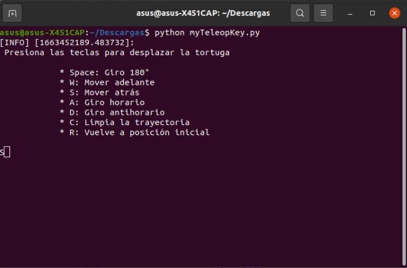

# Laboratorio 2: Introducción a ROS
## A. Comandos de Linux
Revisando el libro de Mark G. Sobell, "A Practical Guide to Linux Commands,Editors and Shell Programming" se tiene que los comandos mas usado son:
* `cd` Moverse entre directorios. "cd Downloads" "cd ..".
* ls Ver el contenido de la ruta actual o la que se especifique. "ls Downloads" 
* comando --help Obtener ayuda acerca de un comando.

## B. Conexion ROS y Matlab


## C. Implementación en Python
Para la segunda parte del laboratorio se requiere escribir un código en Python que permita operar una tortuga del paquete turtlesim con el teclado,
cumpliendo las siguientes especificaciones:
* Se debe mover hacia adelante y hacia atrás con las teclas W y S
* Debe girar en sentido horario y antihorario con las teclas D y A.
* Debe retornar a su posición y orientación centrales con la tecla R
* Debe dar un giro de 180° con la tecla ESPACIO
* Adicionalmente: Limpia la trayectoria con la letra C

https://user-images.githubusercontent.com/53317895/190927226-6b0b070e-a585-4e16-aef4-90da174061b9.mp4

### Reconocer entradas del teclado 
Se inicia instalando el paquete **pynput.keyboard** el cual contiene clases para controlar y monitorear el teclado. **pynput** es la biblioteca de Python que se puede usar para capturar entradas de teclado. Para realizar la instalación de esta libreria se ejecuta el siguiente comando desde la terminal:
```console
pip install pynput 
```
Es probable que no se encuentre la orden «pip», pero se puede instalar ejecutando el comando:
```console
sudo apt install python3-pip
```
 ### Ejecución del código
  
 Se requiere abrir tres terminales y ejecutar los siguientes comandos:
 
 https://user-images.githubusercontent.com/53317895/190927270-e21fafde-22e5-4954-af09-41735a648172.mp4
 
 #### Primer terminal
 Es el nodo maestro, el cual lanza los nodos requeridos para el funcionamiento de ROS 
 ```console
roscore
```
  #### Segundo terminal
 Lanza el nodo de la tortuga, contenido en el paquete de turtlesim, este paquete viene instalado por defecto con los demás paquetes de ROS 
 ```console
rosrun turtlesim turtlesim_node
```
#### Tercer terminal 
 Por ultimo se ejecuta el programa de Python llamado myTeleopKey.py, **es necesario que la terminal se abra dentro de la carpeta que contiene el archivo**, esto se puede hacer especificando la ruta de la carpeta o abriendo la carpeta y eligiendo la opción de "Abrir en una terminal" que aparece al dar click derecho al interior de la carpeta

 ```console
python myTeleopKey.py
```

Una vez ejecutado este ultimo comando debe desplegarse el siguiente menu:

<p align="center"></p>

### Explicación del código 

En la primer sección del codigo se importan las librerias de ROS mediante las cuales se opera la tortuga, a partir de estas librerias se accede a funciones y servicios de Turtlesim, en seguida inicia la clase **miTeleopKey( )**
* Se presenta un menú en la consola mediante la función rospy.loginfo(), el cual es un metodo de ROS para presentar un mensaje, en este caso funciona similar a un print
 ```python
   # Print de comandos
        welcome = """\n Presiona las teclas para desplazar la tortuga
            * Space: Giro 180°
            * W: Mover adelante
            * S: Mover atrás
            * A: Giro horario
            * D: Giro antihorario        
            * C: Limpia la trayectoria
            * R: Vuelve a posición inicial
                  """
        rospy.loginfo(welcome)
 ```
* Se realiza la implementación de la libreria pynput.keyboard, mediante la cual se detecta la letra se detecta la tecla pesionada, se añade y remueve como variable 
```python 
        # Se detecta y almacena como una variable la tecla presionada
        self.keysPressed = set()
        listener = Listener(on_press=self.onPress, on_release=self.onRelease)
        listener.start()

        rate = rospy.Rate(10)
        while not rospy.is_shutdown():
            linear = 0
            angular = 0
      # Funciones para detectar tecla precionada   
    def onPress(self, key):
        print("\033[A")  # Borra en la tecla impresa en la terminal 
        self.keysPressed.add(key) 
    def onRelease(self, key):
        self.keysPressed.remove(key)
```

* Para las letras W, S, A y D se realiza la publicación de un mensaje de tipo Twist al nodo de la tortuga, especificamente al topico **cmd_vel** que recibe información de la velocidad lineal y angular del robot 
```python 
            # Las teclas W S A D aumentan o decrecen la velocidad lineal y angular
            if KeyCode.from_char('w') in self.keysPressed:
                linear += 1
            # Se publica la velocidad
            self.pubVel(linear, angular)
            rate.sleep()

     # Funcion para publicar velocidad   
    def pubVel(self, linear, angular): 
        pub = rospy.Publisher('/turtle1/cmd_vel', Twist, queue_size=10)
        msg = Twist()
        msg.linear.x = linear
        msg.angular.z = angular
        pub.publish(msg)


 ```
 * Las teclas espacio, R y C, utilizan metodos diferentes para controlar la tortuga, en este caso se utilizan servicios asociados al nodo, especificamente los servicios: 
   * /teleport_relative, el cual recibe como argumentos posición lineal y angulo, posibilitando el movimiento de la tortuga desde su posición actual 
   * /teleport_absolute, este servicio recibe como argumentos las coordenadas x,y de la tortuga y su angulo respecto al eje horizonal
   * /clear, este servicio limpia la pantalla en la cual se mueve la tortuga 
```python 
            # La tecla espacio realiza una rotación relativa
            if Key.space in self.keysPressed:
                rospy.wait_for_service('/turtle1/teleport_relative')
                try:
                    rotateTurtle = rospy.ServiceProxy(
                        '/turtle1/teleport_relative', TeleportRelative)
                    moveRsp = rotateTurtle(0, np.pi)                    
                except rospy.ServiceException as e:
                     print(str(e))

 ```
```python 
           # La tecla r realiza un movimiento absoluto
            if KeyCode.from_char('r') in self.keysPressed:
                rospy.wait_for_service('/turtle1/teleport_absolute')
                try:
                    teleportA = rospy.ServiceProxy(
                        '/turtle1/teleport_absolute', TeleportAbsolute)
                    resp1 = teleportA(5.5, 5.5, 0)
                    print('Teleported to home')
                except rospy.ServiceException as e:
                    print(str(e))

 ```
```python 
              # La tecla C limpia la trayectoria realizada
            if KeyCode.from_char('c') in self.keysPressed:
                try:
                     rospy.wait_for_service('clear')
                     clear_bg = rospy.ServiceProxy('/clear', Empty)
                     clear_bg()
                     print('Limpiar trayectoria')
                except rospy.ServiceException as e:  
                     print(str(e))
                                  
```
